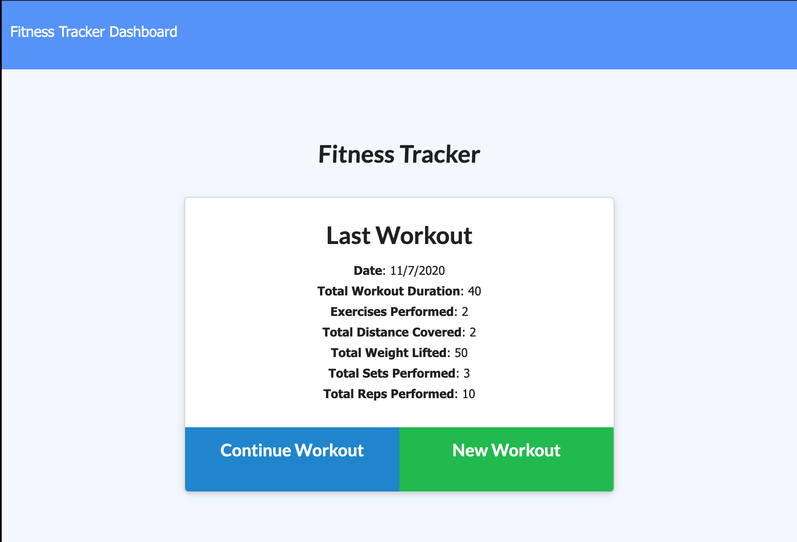

# Fitness Tracker



## Deployment

[Deployment](https://calm-ridge-04693.herokuapp.com/)
[Repo](https://github.com/jenryhennifer/fitnessTracker)

## Tech Used

* npm
* node.js
* MongoDB
* Heroku
* Git
* express
* mongoose

## Description

The purpose of this project was to create a fitness tracker that uses mongoDB and mongoose to store data. A schema was created using mongoose to create a template for our data. The required information needed inside of the database was day, type of exercise, name, and duration. Other keys were added to the schema so data will be stored depending on if the user chose cardio or resistance. 

```
const exerciseSchema = new Schema(
  {
    day: {
      type: Date,
      default: Date.now(),
    },

    ...

```

HTML Routes were added to connect the url to the proper HTML files using express. 

```
  router.get('/', function (req, res) {
    res.sendFile(path.join(__dirname, '../public/index.html'));
  });
```
API routes were also addded to ensure data was being stored properly. This files uses the CRUD (create read update delete) model to create, manipulate, or view data from the database. Mongoose was used to handle these tasks.

```
router.post('/api/workouts', ({ body }, res) => {
  Exercise.create(body)
    .then((dbExercise) => {
      res.json(dbExercise);
    })
    .catch((err) => {
      res.status(400).json(err);
    });
});
```
Mongoose was used to connect to the URI. MongoDB Atlas was created and connected to Heroku durring deployment to allow users to see data from any device and not relying on the local host as its server. 

```
mongoose.connect(
    process.env.MONGODB_URI || 'mongodb://localhost/dbExercise',
    {
      useNewUrlParser: true,
      useUnifiedTopology: true,
      useCreateIndex: true,
      useFindAndModify: false
    }
  );
```


## License

MIT License

Copyright (c) 2020 Jennifer Henry

Permission is hereby granted, free of charge, to any person obtaining a copy of this software and associated documentation files (the "Software"), to deal in the Software without restriction, including without limitation the rights to use, copy, modify, merge, publish, distribute, sublicense, and/or sell copies of the Software, and to permit persons to whom the Software is furnished to do so, subject to the following conditions:

The above copyright notice and this permission notice shall be included in all copies or substantial portions of the Software.

THE SOFTWARE IS PROVIDED "AS IS", WITHOUT WARRANTY OF ANY KIND, EXPRESS OR IMPLIED, INCLUDING BUT NOT LIMITED TO THE WARRANTIES OF MERCHANTABILITY, FITNESS FOR A PARTICULAR PURPOSE AND NONINFRINGEMENT. IN NO EVENT SHALL THE AUTHORS OR COPYRIGHT HOLDERS BE LIABLE FOR ANY CLAIM, DAMAGES OR OTHER LIABILITY, WHETHER IN AN ACTION OF CONTRACT, TORT OR OTHERWISE, ARISING FROM, OUT OF OR IN CONNECTION WITH THE SOFTWARE OR THE USE OR OTHER DEALINGS IN THE SOFTWARE.


<hr />
<hr />

# Author

* [LinkedIn](https://www.linkedin.com/in/jennifer-henry-4a540a149/)
* [GitHub](https://github.com/jenryhennifer)
* jenhenry1995@gmail.com